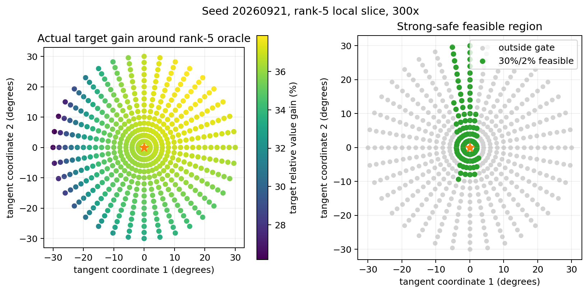

# Repair-Space Characterization

**日期：2026-09-04**

## 判定口径

强安全修复同时要求：目标相对长期价值提升至少 30%，protection top-value harm 不超过 2%，且 protection 中 `DeltaV < -0.01` 的比例不超过 2%。本面板的离散样本量使两个 2% 条件实际上都要求零个违规状态。

`full-panel oracle` 只回答有限 output-gradient span 中是否存在方向，是乐观上界；`validation-only` 只在 validation 上选方向，隐藏 holdout/protection 才是泛化判定。所有表中数值均来自真实 multi-token softmax，而非一阶预测。

## 总结果

- 搜索规模：四个 seed 共一阶预筛 **240 万**个单位方向；GPU 对 **4,585** 个方向–强度候选执行完整 multi-token 非线性评分，得到 **137,550** 个逐状态参数修改响应。
- 强安全单方向只在 **1/4 seed** 的完整面板 oracle 中存在；validation-only 选择后，隐藏测试通过率是 **0/4**。
- rank 1–2 在四个 seed 中都没有找到满足 protection 条件的方向；唯一超过 30% 的安全方向直到 rank 5 才出现。
- 这否定了“一个稳定低维全局 output direction 就足够”的当前证据，但不能证明整个 output-gradient span 数学上无解。
- 当前 G4→G12 与新 feedback 主要仍沿既有方向移动；它们并未系统靠近 full-panel 的安全 Pareto 区域。
- SEED 在同一目标面板平均提升 **20.18% ± 5.72%**，top-value harm 为 0，但仍有 **22.92%** protection 状态的长期价值下降超过 0.01；因此 SEED 也不满足这里更严格的 value-safety gate。

## 1. Single-direction feasibility

| seed | full-panel strong-safe ≥30% | best safe rank | 强度 | best safe target gain | top harm | DeltaV<-0.01 | validation-selected hidden target | hidden top harm | hidden DeltaV<-0.01 |
|---:|:---:|---:|---:|---:|---:|---:|---:|---:|---:|
| 20260904 | no | — | — | — | — | — | 8.76% | 11.11% | 0.00% |
| 20260921 | yes | 5 | 300x | 36.65% | 0.00% | 0.00% | 23.37% | 33.33% | 22.22% |
| 20260938 | no | 4 | 300x | 10.96% | 0.00% | 0.00% | 34.11% | 33.33% | 33.33% |
| 20260955 | no | 4 | 600x | 25.85% | 0.00% | 0.00% | — | — | — |

有限面板中找到强安全单方向的 seed 比例：**1/4**。validation 选择后在隐藏测试仍通过全部门槛：**0/4**。表中未达到 30% 的 full-panel 数值表示“安全但不够强”，不是强安全成功。

## 2. Feasible repair rank

下表报告每个最大允许 rank 下，满足 protection 安全门槛时可找到的最高 target gain（`—` 表示搜索中连安全方向都未找到）。数值达到 30% 才通过强修复门槛。

| rank | 20260904 | 20260921 | 20260938 | 20260955 |
|---:|---:|---:|---:|---:|
| 1 | — | — | — | — |
| 2 | — | — | — | — |
| 3 | — | 27.53% | — | 6.92% |
| 4 | — | 29.49% | 10.96% | 25.85% |
| 5 | — | 36.65% | 10.96% | 25.85% |
| 6 | — | 36.65% | 10.96% | 25.85% |

唯一强安全 seed 的邻域复核：

| seed | strong-safe sampled points | components at 20° | maximum pairwise angle |
|---:|---:|---:|---:|
| 20260904 | 0 | 0 | — |
| 20260921 | 8 | 1 | 17.44° |
| 20260938 | 0 | 0 | — |
| 20260955 | 0 | 0 | — |

## 3. Rank-2 connectivity

| seed | strength | safety-only coverage | safety components | 30%/2% feasible coverage | feasible components |
|---:|---:|---:|---:|---:|---:|
| 20260904 | 1200x | 0.0% | 0 | 0.0% | 0 |
| 20260904 | 3000x | 0.0% | 0 | 0.0% | 0 |
| 20260921 | 1200x | 0.0% | 0 | 0.0% | 0 |
| 20260921 | 3000x | 0.0% | 0 | 0.0% | 0 |
| 20260938 | 1200x | 0.0% | 0 | 0.0% | 0 |
| 20260938 | 3000x | 0.0% | 0 | 0.0% | 0 |
| 20260955 | 1200x | 0.0% | 0 | 0.0% | 0 |
| 20260955 | 3000x | 0.0% | 0 | 0.0% | 0 |

### Rank-5 成功点的局部连通性复核

对 seed `20260921` 的唯一成功区域，在 300x 下围绕 oracle 中心做 541 点 rank-5 二维切平面扫描：强安全点 **112 / 541（20.7%）**，形成 **1 个连通分量**。中心半径 2° 内全部方向可行；至少一个可行方向延伸至 30°。这说明该 seed 中不是孤立采样噪点，而是一个连续但高度各向异性的高维 feasible basin。

## 4. Target/protection coefficient overlap

| seed | target within cosine | protection within cosine | target–protection cosine | LOO balanced accuracy | target span capture | protection span capture |
|---:|---:|---:|---:|---:|---:|---:|
| 20260904 | 0.304 | 0.047 | 0.157 | 62.5% | 71.0% | 45.0% |
| 20260921 | 0.585 | 0.092 | 0.080 | 79.2% | 86.9% | 62.2% |
| 20260938 | 0.380 | -0.026 | -0.078 | 66.7% | 72.4% | 60.9% |
| 20260955 | 0.569 | 0.005 | -0.048 | 79.2% | 86.4% | 47.9% |

## 5. Evolution trajectory 与 held-out feedback

| seed | cos(G4,G12) | cos(feedback,G12) | feedback residual novelty | cos(best-safe,G4) | cos(best-safe,G12) | cos(best-safe,feedback) |
|---:|---:|---:|---:|---:|---:|---:|
| 20260904 | 0.887 | 0.785 | 0.380 | — | — | — |
| 20260921 | 0.944 | 0.941 | 0.449 | 0.622 | 0.510 | 0.582 |
| 20260938 | 0.924 | 0.865 | 0.388 | 0.083 | -0.081 | 0.113 |
| 20260955 | 0.917 | 0.908 | 0.436 | 0.250 | 0.153 | -0.152 |

这里的 best-safe 是各 seed 在完整面板上满足 protection 安全条件的最高 gain 点，不是可部署选择；余弦只用于解释现有 evolution trajectory 是否靠近该有限面板区域。

## 6. 与 SEED 的同面板横向参照

| seed | SEED full target gain | SEED full top harm | SEED full DeltaV<-0.01 | SEED hidden target | validation-selected OGSE hidden target | OGSE hidden top harm |
|---:|---:|---:|---:|---:|---:|---:|
| 20260904 | 12.69% | 0.00% | 16.67% | 15.04% | 8.76% | 11.11% |
| 20260921 | 24.37% | 0.00% | 25.00% | 12.76% | 23.37% | 33.33% |
| 20260938 | 18.75% | 0.00% | 25.00% | 25.38% | 34.11% | 33.33% |
| 20260955 | 24.91% | 0.00% | 25.00% | 11.85% | — | — |

## 7. 对 A / B / C 三种可能性的判定

### A：存在一个稳定的 single safe direction

当前不支持。完整面板强安全方向仅在 1/4 seed 出现，且 validation-only 无一在隐藏测试保持 30%/2%。所以不能把 seed 20260921 的 oracle basin 当作通用方向。

### B：需要低维连续组合空间

得到部分支持，但维度高于最初预期。rank 1–2 没有任何安全方向；唯一强安全区域在 rank 5 出现，并且局部切面是单个连续 basin。也就是说，至少在成功 seed 上，continuous coefficient space 比 hard branch 更符合观测，但不是 2–3 维就足够。

### C：不存在对所有状态统一安全且可泛化的 output 修改

这是当前跨 seed 证据最支持的解释，但仍只能表述为经验性结论。目标/protection 的 per-state coefficient 只能以 **71.9% ± 8.6%** balanced accuracy 分开，存在明显重叠；同时 validation 方向在隐藏 protection 上频繁失效。需要扩大独立状态面板或进入 deeper-layer span 才能判断这是有限采样问题还是 output-head capacity 上限。

### Evolution / feedback 几何

四个 seed 的 `cos(G4,G12)` 平均为 **0.918**，`cos(feedback,G12)` 平均为 **0.875**。这说明后期累积与新 feedback 大多强化既有方向，而不是自动转向安全 Pareto 区域。反馈有新分量不等于它提供了有益的 feasible-space displacement。

## 8. 当前可执行结论

1. 不应继续优化单一 mean/weighted output gradient 并期待它自然满足 30%/2%。
2. 也不应仅凭一个 seed 的连续 basin 就提前决定采用 basis 或 branch；该 basin 尚未跨 seed、跨隐藏状态复现。
3. 下一项机制实验应直接比较：同样的 target/protection 面板在完整 12 维 output span 与 final-MLP/deeper span 中，强安全可行率是否上升。若 output full-span 仍低而 deeper span 明显上升，瓶颈是表示可分性；若 full-span 上升，则当前 rank-6 截断/搜索覆盖不足。
4. 任何后续 evolution operator 都必须以隐藏 protection 验证为准；full-panel oracle 只能用于证明 capacity，不能用于报告可部署性能。

## 图

- `gain_harm_pareto.png`：真实非线性 Gain–Harm Pareto 样本。
- `feasible_repair_rank.png`：安全门槛下的 rank–capacity 曲线。
- `repair_space_trajectory.png`：二维可行区域、G1→G12 搜索轨迹和 held-out feedback。
- `target_protection_coefficients.png`：目标与 protection 的 per-state optimal repair coefficients。

## 结论边界

本实验是在固定有限状态面板与 12 个 source-gradient span 内进行的强度/方向搜索。找到方向可证明该有限空间中存在候选解；没有找到只能说明在预注册的 100k/rank 随机搜索及二维稠密网格中未发现，不能当作数学上的不可行证明。validation-only 的隐藏测试结果才回答该方向是否能从稀疏反馈泛化。
