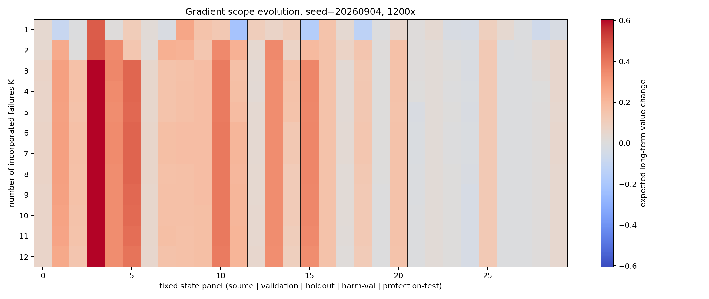
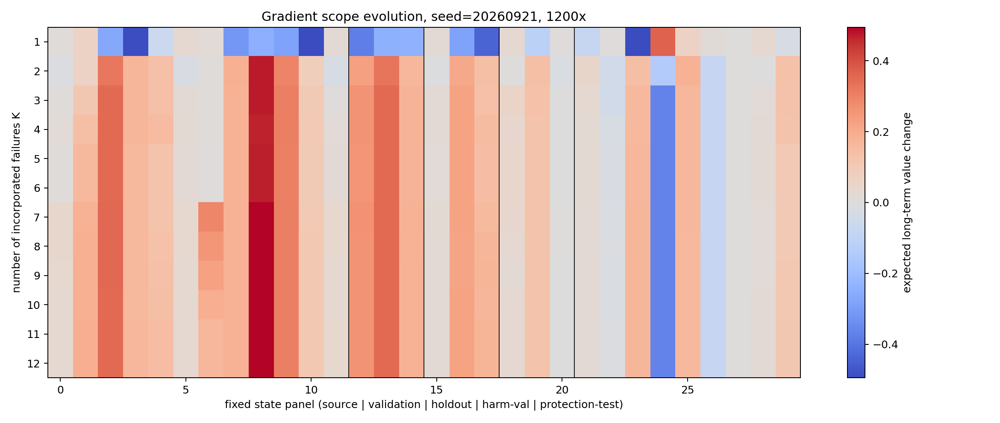
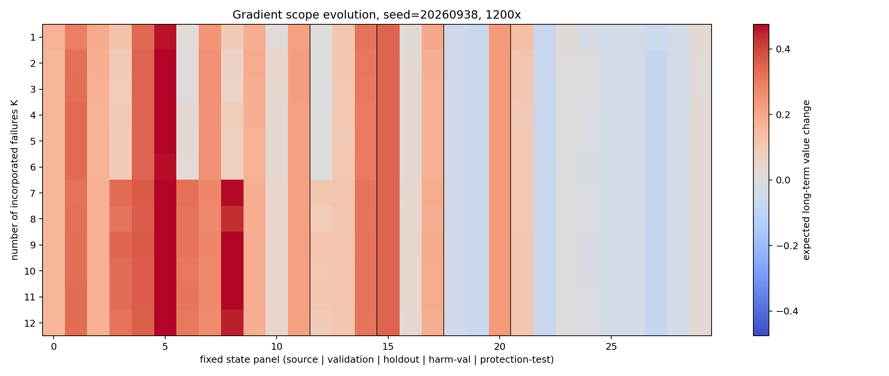
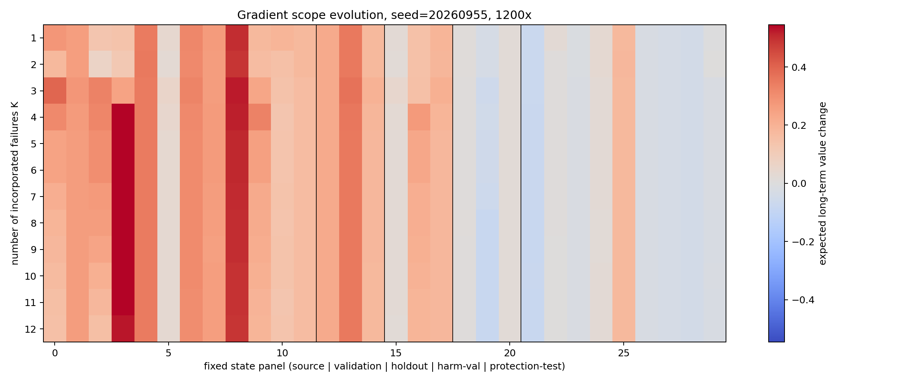

# Gradient Scope Tomography：输出梯度作用域如何进化

**日期：2026-09-04**

## 核心边界

精确成立的是 frozen-backbone、untied output head 下的 logit 迁移定律。
长期价值变化经过 softmax、multi-token action score 和动作价值映射，属于经验响应，
不能由 hidden similarity 单独推出。

## 实验规模

- 4 个随机 seed；每个 seed 固定 30 状态（12 source、3 validation、3 independent holdout、3 harm-validation、9 independent protection）。
- 每个方向扫描 K=1..12 和 300x/600x/900x/1200x/3000x，共 7,200 个 state × gradient 条件。
- 梯度方向的 fitness 固定在 1200x validation 上计算；所有剂量共享同一个方向，因而 direction 与 magnitude 被分离。
- 作用域阈值使用绝对长期价值变化 ε=0.01，避免把浮点级波动算成有效 scope。

## 1. 公式验证与解释边界

对 output head 的精确式为：

$$\Delta z_{j,t}=-\eta\sum_r\delta_{i,r}(h_{i,r}^{\top}h_{j,t}).$$

它说明参数更新在 target logits 上产生什么变化；此前真实 writeback 与 virtual repair 的最大
action-score 误差为 $1.07\times10^{-4}$，所以实现层面的等价关系成立。

但 $\Delta V_j$ 还经过 softmax、sequence aggregation、action ranking 和环境价值映射。
因此 hidden overlap 只参与 influence，不能单独决定 utility 的符号；utility 更直接的一阶量是
$\langle G_t,g_j\rangle$。以下结果全部把这两层命题分开报告。

## 2. K 轴：作用域主要在前三条经验形成

| K | holdout 相对价值 | 独立 close 正覆盖 | protection 负覆盖 | protection 平均 ΔV |
|---:|---:|---:|---:|---:|
| 1 | +5.17% | 70.8% | 50.0% | -0.0025 |
| 2 | +27.03% | 91.7% | 41.7% | +0.0100 |
| 3 | +30.43% | 95.8% | 41.7% | +0.0023 |
| 4 | +31.88% | 95.8% | 44.4% | +0.0018 |
| 6 | +31.16% | 95.8% | 47.2% | +0.0005 |
| 8 | +31.37% | 100.0% | 47.2% | +0.0008 |
| 12 | +30.48% | 100.0% | 41.7% | +0.0010 |

从 K=1 到 K=2，梯度平均旋转 59.39°，独立 close 中 29.2% 的状态跨越 ε=0.01 的
scope 边界；K=2 到 K=3 又旋转 39.74°，但只有 4.2% close 状态换区。K≥3 后
close 的符号作用域几乎固定，收益主要表现为强度变化，而不是继续扩大 coverage。

G4 到 G12 仍累计旋转 25.21°，但独立 close 正作用域 Jaccard 为 0.958，只有 4.2% 状态换区；protection 的 ε=0.01 正作用域 Jaccard 为 1.000。这说明 K=4→12 的主要现象不是 scope 持续扩张，而是已形成作用域内的增益饱和和强度重分配。

## 3. 剂量轴：harm 主要是结构冲突，剂量只进一步泄漏

| 固定方向 | 剂量 | close 正覆盖 | protection 负覆盖 | protection 平均 ΔV |
|---|---:|---:|---:|---:|
| G4 | 300x | 79.2% | 36.1% | +0.0052 |
| G4 | 600x | 87.5% | 38.9% | +0.0061 |
| G4 | 900x | 95.8% | 41.7% | +0.0039 |
| G4 | 1200x | 95.8% | 44.4% | +0.0018 |
| G4 | 3000x | 95.8% | 44.4% | -0.0011 |
| G12 | 300x | 83.3% | 36.1% | +0.0039 |
| G12 | 600x | 95.8% | 41.7% | +0.0058 |
| G12 | 900x | 100.0% | 44.4% | +0.0033 |
| G12 | 1200x | 100.0% | 41.7% | +0.0010 |
| G12 | 3000x | 95.8% | 44.4% | -0.0011 |

G4/G12 在 300x 已各有 36.1% / 36.1% protection 状态受到超过 0.01 的伤害；一阶 compatibility 为负的比例更达到 55.6% / 58.3%。

从 300x 增至 1200x 后，新增的 dose-emergent harm 只占 13.9% （G4）和 13.9%（G12）；一阶预测为正却在 1200x 真实转负的 nonlinear reversal 仅 2.8%。

因此当前 40%–50% harm 不能主要归因于“方向正确但剂量太大”。多数冲突在一阶方向上已经存在，
属于 structural repair conflict；单纯缩步长会减弱伤害，却不会消除冲突状态。

## 4. 一阶 compatibility 比 influence 更能预测 utility

| 方向 | 剂量 | compatibility→ΔV Spearman | 符号准确率 | influence→ΔV Spearman |
|---|---:|---:|---:|---:|
| G1 | 300x | 0.903 | 95.0% | 0.090 |
| G1 | 1200x | 0.704 | 83.3% | 0.156 |
| G1 | 3000x | 0.363 | 68.3% | 0.441 |
| G4 | 300x | 0.951 | 95.0% | 0.412 |
| G4 | 1200x | 0.897 | 83.3% | 0.441 |
| G4 | 3000x | 0.860 | 78.3% | 0.463 |
| G12 | 300x | 0.953 | 95.0% | 0.415 |
| G12 | 1200x | 0.896 | 81.7% | 0.442 |
| G12 | 3000x | 0.856 | 76.7% | 0.466 |

G4/G12 在 300x 时 $\langle G,g_j\rangle$ 与真实 ΔV 的 Spearman 均约 0.95；
到 1200x 仍约 0.90，到 3000x 降至约 0.86。也就是说，一阶 validity scope 在强更新下仍
有很强预测力，但随非线性增强而有序退化。相比之下，logit influence norm 对 utility 的相关性
只有约 0.41–0.47，证明“作用得强”不等于“作用得对”。

在独立 close 内，G4 的 weighted mean-hidden cosine→influence Spearman 只有 0.129；在 protection 内为 0.600。这个 mean-hidden 标量本身也不是 multi-token 精确 kernel；它不能替代完整 token-pair contraction，更不能直接当作 validity 判据。

## 5. 新 family 第一次 feedback：旧比较没有证明继续进化

此前 `+49.64% → +51.53%` 比较了不同状态集合：feedback state 在后一个数字里被移除。
现在只比较两次评测共有的 4 个 unseen states/seed。

共有状态上的绝对反馈效应为 -0.000322 ± 0.003551，相对反馈效应为 -0.07% ± 0.76%。4 个 seed 中仅 1 个为正；正作用域 Jaccard 为 1.0。

所以严格结论是：historical gradient 的 zero-shot transfer 仍然很强，但第一次新-family failure
没有在共同测试状态上产生可复现的额外净收益，也没有扩张正作用域。`feedback → evolve` 这一环目前未被证明，必须撤回先前基于不等样本集合的增强表述。

## 6. 当前 Gradient Scope 结论

1. logit transfer law 是精确的；behavioral validity scope 是经验对象，两者不能混称。
2. 多源 consolidation 的主要作用域形成发生在前 2–3 条 failure；K=4 后主要是饱和，不是持续扩张。
3. protection harm 以结构性负 compatibility 为主，dose-induced leakage 为辅。
4. $\langle G_t,g_j\rangle$ 是当前最强的 scope predictor；hidden similarity 或 influence magnitude 单独不足。
5. 新-family zero-shot repair 成立，但一次 feedback 并未让共同 holdout 继续改善，因此完整自进化闭环尚未成立。
6. 这些结果支持下一步研究 gradient branching / repair-direction decomposition；目前仍不应预设轻量 gate 是答案。

## 图

## 机器可读结果

完整逐状态矩阵、相关性、scope transition、first-order/empirical 一致性和 held-out family feedback
见 `gradient_scope_tomography.json` 以及每个 seed 的 `.npz`。
