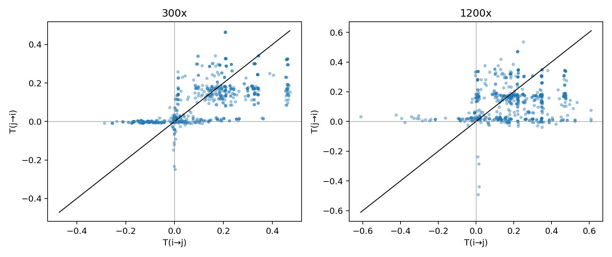
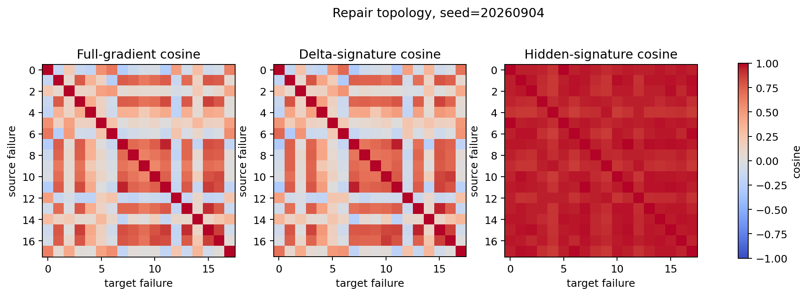
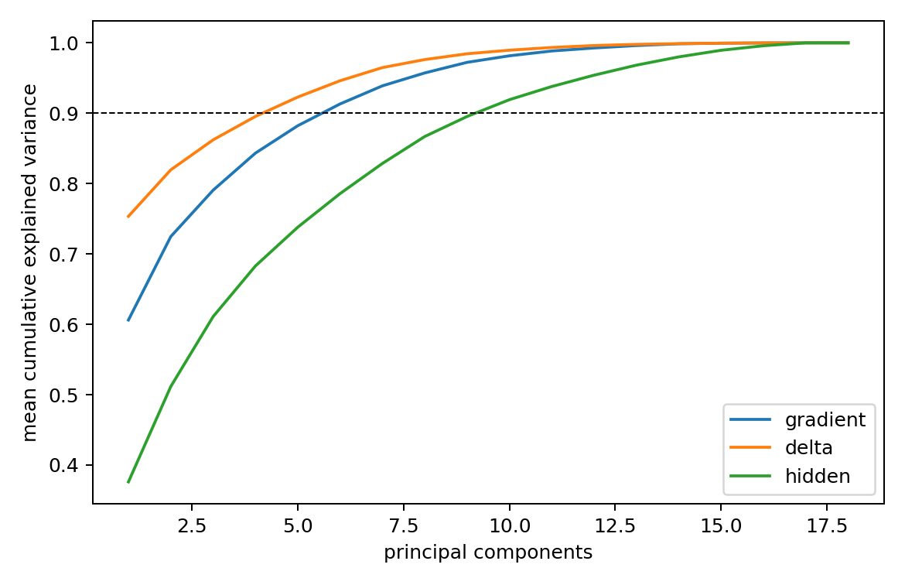

# Gradient Scope Topology：冲突结构、有效维度与 Feedback Novelty

**日期：2026-09-04**

## 核心结论

本轮没有设计 gate、branch 或新的训练算法，只回答作用域拓扑问题。结果表明：

1. `close` failure gradients 在每个 seed 内都出现明显的二分 signed structure；负 compatibility 边的 `99.4%` 位于两个分区之间。
2. 这个结构几乎完全来自 repair direction：full-gradient 与 delta topology 的 edge correlation 为 `0.996`，聚类 ARI 为 `1.000`；full-gradient 与 hidden topology 的 ARI 约为 `−0.026`。
3. 但该二分的跨 seed episode-level ARI 只有 `0.318`，也不能由 task label 稳定解释。因此目前能说“存在局部 repair modes”，还不能说已经找到稳定、通用的两个 gradient species。
4. delta/full-gradient 明显低秩：90% centered variance 分别只需约 `5/6` 个方向；hidden 需要约 `9.75` 个方向，真实 transfer response 只需约 `2.5` 个方向。
5. 新梯度 novelty 与 sequential marginal gain 正相关，但 algebraic novelty 不是充分条件。held-out feedback 仍有约 `39.8%` span residual，却没有新增任何 unseen positive-scope state，合并后共同状态收益仍接近零。

因此，现阶段证据比“立即 hard branch”更支持：

> **repair space 是低维且带有局部 signed partitions 的；先研究 repair-direction basis 与分区稳定性，再决定是否需要真正的 speciation。**

---

## 1. 实验设计

- 4 个随机 seed。
- 每个 seed 使用 18 个 episode-distinct `close` failure gradients。
- 每个 seed 得到 `18×18` 的 (C_g,C_\delta,C_h) 矩阵。
- 真实测量 300x 和 1200x 下的全部有向 `close→close` transfer：每个剂量 `4×18×17=1,224` 对，共 `2,448` 对。
- 加上 protection panel，共执行 `4,320` 个 source–target–dose 评分条件。
- sequential novelty 使用与原 (G_1\rightarrow G_{12}) 完全相同的 source 顺序。
- held-out feedback 使用与原 zero-shot family 实验完全相同的 9 条历史梯度、feedback state 和共同测试状态。

delta signature 定义为一个状态所有 candidate-action token-position logit gradients 的均值；hidden signature 同理。full-gradient inner product 使用完整 multi-token 低秩原子精确计算，而不是 signature 近似。

---

## 2. Transfer 是对称 similarity，还是有向 graph？

| 指标 | 300x | 1200x |
|---|---:|---:|
| (\rho(T_{ij},T_{ji}))，Spearman | 0.674 ± 0.085 | 0.167 ± 0.163 |
| 原始正负号一致率 | 85.5% ± 3.3% | 83.0% ± 11.8% |
| ε=0.01 三分类一致率 | 65.0% ± 10.6% | 74.8% ± 11.6% |
| 明确相反符号比例 | 1.0% ± 1.1% | 7.7% ± 5.4% |
| normalized magnitude asymmetry | 0.540 ± 0.052 | 0.525 ± 0.084 |

300x 下，(T_{ij}) 与 (T_{ji}) 的排序仍有中等相关，明确的双向异号只有约 1%；所以“小到中等强度下的 compatibility sign”接近 signed similarity。

但 transfer magnitude 从一开始就明显不对称，到 1200x 时双向排序相关降至 `0.167`，明确异号升至 `7.7%`。这是因为即使 ⟨(g_i,g_j)⟩ 对称，实验固定的是 source update norm：

$$
\Delta V_{i\rightarrow j}^{FO}
\propto
\frac{\langle g_i,g_j\rangle}{\|g_i\|},
$$

反向则除以 ‖(g_j)‖，强剂量下还叠加 target-specific 非线性。

严格结论是：

> **compatibility topology 可以先作为近似 signed graph；真实 transfer utility，尤其强更新下，必须保留方向。**

---

## 3. Conflict 是否形成 block structure？

对每个 seed，在 cosine geometry 中搜索 2–6 个 spectral partitions。四个 seed 均选择 2 个分区：

| 空间 | silhouette | within cosine | between cosine | gap | 负边比例 | 负边位于分区间 |
|---|---:|---:|---:|---:|---:|---:|
| Full gradient | 0.397 | 0.608 | −0.066 | 0.674 | 26.1% | 99.4% |
| Delta signature | 0.402 | 0.613 | −0.063 | 0.676 | 25.5% | 99.4% |
| Hidden signature | 0.285 | 0.959 | 0.916 | 0.043 | 0.0% | — |

更关键的是：

| 对照 | 结果 |
|---|---:|
| Full-gradient vs delta edge correlation | 0.996 |
| Full-gradient vs delta cluster ARI | 1.000 |
| Full-gradient vs hidden edge correlation | 0.363 |
| Full-gradient vs hidden cluster ARI | −0.026 |

因此在当前 `close` failure 集中：

$$
\boxed{\text{signed scope topology 主要由 }\delta\text{ repair mode 决定，而不是 hidden neighborhood。}}
$$

不过不能直接把两个分区命名为两个稳定 species：

- 分区大小在四个 seed 中分别为 `11/7、14/4、15/3、16/2`；
- 同一批 18 个 episode 跨 seed 的 partition ARI 只有 `0.318`；
- 与 task type 的 NMI 仅比随机置换高 `0.023`；
- expert action 高 `0.094`，仍不足以形成稳定语义定义。

所以当前观察更像是每个 anchor/sample 下由少数 repair outliers 形成的局部 signed partition，而不是已经稳定复现的全局 skill taxonomy。

其余三个 seed 的矩阵也保存在本目录中。

---

## 4. Branch 还是低秩 Decomposition？

对 centered Gram matrix 做精确 kernel PCA/SVD：

| 空间 | participation rank | 80% 分量数 | 90% 分量数 | 95% 分量数 |
|---|---:|---:|---:|---:|
| Full-gradient atoms | 2.56 | 3.75 | 6.00 | 8.00 |
| Delta signatures | 1.74 | 2.25 | 5.00 | 6.75 |
| Hidden signatures | 5.38 | 6.75 | 9.75 | 12.25 |
| Empirical transfer response | 1.97 | 2.00 | 2.50 | 3.25 |

四个 seed 的 delta 90% variance 都恰好只需 5 个成分；full-gradient 需要 5–7 个，真实 transfer response 只需 2–3 个。

这给出两个同时成立的事实：

1. signed partition 确实存在，hard branching 是合理候选；
2. repair/behavior space 更明显地呈连续低秩，且 cluster membership 的跨 seed 稳定性不足。

目前更强的证据指向 **Repair-Direction Basis**，但可在 basis coefficient 上继续检查是否会自然形成稳定分支；不能仅凭一次二分 silhouette 就提交 hard species。

---

## 5. Novelty 是否预测 Evolution Gain？

对每个新 source gradient 定义：

$$
\nu_t=
\frac{\|g_t-P_{\mathrm{span}(g_{<t})}g_t\|}{\|g_t\|}.
$$

在 4 seed × 11 transitions = 44 个 (G_{t-1}\rightarrow G_t) 上：

| Novelty | 与 marginal holdout gain 的 Spearman | 与正 coverage 变化的 Spearman |
|---|---:|---:|
| Span residual novelty | 0.622 | 0.436 |
| (1-\max\cos) | 0.605 | 0.422 |

只看 K≥4 的饱和阶段，按 span novelty 中位数分组：

| 分组 | 平均 novelty | 平均边际 ΔV | 边际收益为正 |
|---|---:|---:|---:|
| Low novelty | 0.469 | −0.00215 | 22.2% |
| High novelty | 0.766 | +0.00229 | 50.0% |

Novelty 确实能预测“新梯度是否可能继续增加强度”，但 K≥4 后 holdout coverage 已基本不再变化。因此：

> **parameter-space novelty 是 evolution gain 的有用必要信号之一，但并不等价于 scope expansion，也不是 Merge 的充分条件。**

---

## 6. Scope transition 是否能由新 gradient component 解释？

共归因 1,320 个逐状态 transition：

| Transition | 数量 | 新梯度与 target 的 mean cosine | 新梯度单独作用 mean ΔV | 聚合梯度 mean change |
|---|---:|---:|---:|---:|
| negative→positive | 24 | +0.337 | +0.1768 | +0.4009 |
| neutral→positive | 13 | +0.208 | +0.1101 | +0.0853 |
| positive→negative | 5 | −0.361 | −0.0574 | −0.1493 |
| neutral→negative | 5 | −0.157 | −0.0367 | −0.0224 |
| positive→positive | 935 | +0.385 | +0.1552 | +0.0025 |
| negative→negative | 203 | −0.203 | −0.0432 | −0.0014 |

新增或丢失作用域都与新 component 对 target 的 compatibility 符号一致。这说明 scope transition 不是无法解释的 optimizer noise；新梯度对哪些 target 正/负对齐，确实决定了边界向哪侧移动。

---

## 7. Held-out New-Family Feedback 到底是冗余，还是有新信息？

| 指标 | 均值 ± seed std |
|---|---:|
| Full-gradient span residual novelty | 0.398 ± 0.028 |
| Delta span residual novelty | 0.332 ± 0.072 |
| Hidden span residual novelty | 0.186 ± 0.010 |
| 与历史最近 gradient cosine | 0.860 ± 0.044 |
| 与 historical evolved direction cosine | 0.659 ± 0.151 |
| 合并后共同 target 绝对收益变化 | −0.00044 ± 0.00218 |

它不是参数空间里的完全重复样本：仍有约 40% full-gradient residual，主要新增信息也来自 delta，而不是 hidden。

但是它没有提供新的正作用域：

| Panel | 新增 positive states | 丢失 positive states | 与历史正作用域 Jaccard |
|---|---:|---:|---:|
| Unseen family common states | 0.0% | 18.75% | 0.813 |
| Protection common states | 0.0% | 8.33% | 0.750 |

因此第一次 feedback “没有提升”不能简单解释成 `novelty≈0` 的冗余经验。更准确的结论是：

> **它具有代数 novelty，但没有 beneficial scope novelty；直接 Merge 既不扩张正作用域，也不增加共同状态收益。**

这证明未来的 Retain/Merge/Branch 判断不能只看 residual norm 或 cosine novelty，还必须看 novelty 是否对应新的正 transfer region。

---

## 8. 对未来 Evolution Operator 的约束

本轮还不提交算法，但数据已经排除几种过早结论：

- 不能按 task label branch：repair partition 与 task type 的稳定关系很弱。
- 不能只按 hidden similarity branch：hidden 没有负边，且与 full-gradient partition 无关。
- 不能把所有 algebraically novel feedback 都 merge：held-out feedback 是直接反例。
- 不能把真实 transfer 当成无向 similarity：强剂量下 magnitude 明显有向。

下一阶段若设计方法，应至少同时表示：

1. 低秩 delta/repair basis；
2. basis coefficient 诱导的 signed compatibility；
3. 有向 empirical transfer utility；
4. beneficial scope novelty，而非只有 parameter novelty。

只有当新 feedback 在这些量上表现为：

- 无新正作用域：Retain/Reject；
- 新正作用域且不破坏旧作用域：Merge；
- 新正作用域与旧作用域结构性冲突：再考虑 Branch。

这些 operator 目前是由实验证据约束出的待验证假设，不是本轮已经证明的算法。

---

## 机器可读结果

- `gradient_scope_topology.json`：全部聚合指标、每 seed 谱、聚类、asymmetry、novelty 与 transition attribution。
- `../scope_topology_seed_*.json`：逐 source–target 结果。
- `../scope_topology_seed_*.npz`：(C_g,C_\delta,C_h,T) 原始矩阵。

