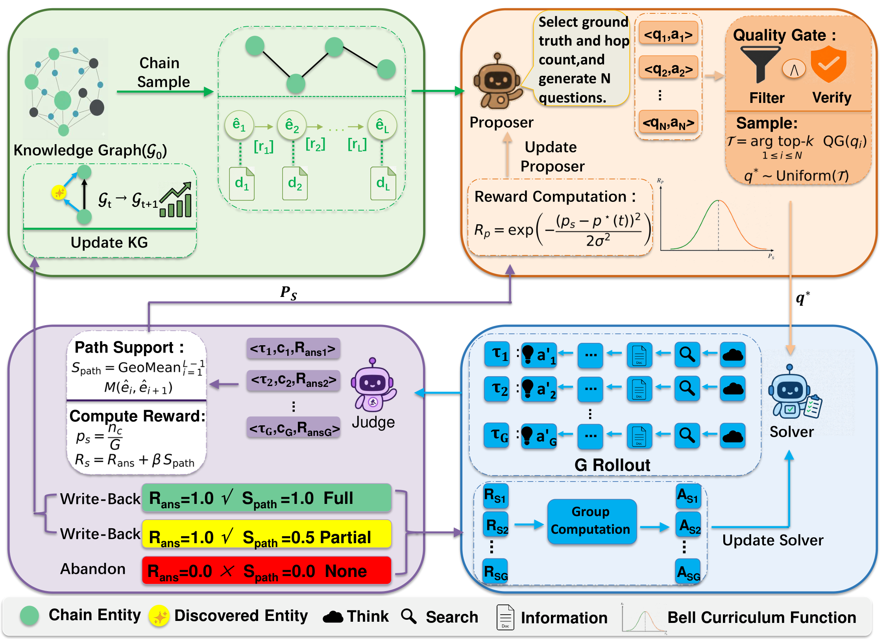

# CoEvoKG: Co-Evolving Knowledge Graphs with Self-Evolving Search Agents

CoEvoKG is a self-play reinforcement-learning framework for search agents. It
uses knowledge-graph entity chains as verifiable multi-hop task templates and
turns successful search trajectories into reusable graph memory through evidence
write-back.

<p align="center">
  
</p>

## Overview

CoEvoKG trains a proposer and a solver in a closed loop:

**Step 1 - KG-chain task generation.** The proposer samples 2-3 hop entity
chains from a train-only KG chain pool and generates candidate multi-hop search
questions. A frozen LLM quality gate filters candidates for answerability,
leakage, and difficulty.

**Step 2 - Solver rollout.** The solver receives generated questions and answers
with multi-turn search through an SGLang rollout backend and a local retrieval
service.

**Step 3 - Graph-grounded rewards.** The solver is rewarded for answer
correctness and path support, while the proposer is rewarded for generating
questions that are challenging but still solvable by the current solver.

**Step 4 - Evidence write-back.** Correct and path-supported solver trajectories
are verified, deduplicated, and written back into the graph memory. Future rounds
sample from this enriched memory, making the training distribution evolve with
the agent.

Training uses GRPO for the solver and a REINFORCE++-style update for the
proposer on top of a customized veRL snapshot with SGLang async multi-turn
rollouts.

## Repository Layout

```text
CoEvoKG/
├── coevokg/                         # Core training package
│   ├── main_rl.py                   # Training entry point
│   ├── config/
│   │   ├── base.yaml                # Shared reward, rollout, self-play settings
│   │   └── train_example.yaml       # Main example config
│   ├── trainer/ppo/coevokg_ray_trainer.py
│   ├── utils/knowledge_chain_proposer.py
│   ├── utils/kg_writer.py           # Evidence write-back utilities
│   ├── tool/search_tool.py          # Search tool used by rollouts
│   └── reward/                      # Reward managers and scorers
├── data_preprocess/
│   ├── prepare_data.py              # Question-pool conversion CLI
│   └── chain_pool_pipeline/         # KG-chain construction utilities
├── evaluation/judge_eval.py         # Offline EM / optional LLM-judge evaluation
├── examples/
│   ├── train_covkg_example.sh       # End-to-end training launcher
│   ├── data/                        # Tiny schema examples for smoke checks
│   └── sglang_multiturn/            # Retrieval service config and helpers
├── verl/                            # Vendored veRL snapshot with local fixes
├── requirements.txt
├── environment.yml
├── LICENSE
└── THIRD_PARTY_NOTICES.md
```

The vendored `verl/` directory is intentional. CoEvoKG imports veRL internals and
uses local synchronization fixes, so do not replace it with an upstream checkout
unless those changes are re-applied.

## Installation

```bash
git clone https://github.com/lazzy1225/CoEvoKG.git
cd CoEvoKG

conda create -n coevokg python=3.10 -y
conda activate coevokg

pip install -r requirements.txt
pip install -e ./verl
export PYTHONPATH=$PWD/verl:$PWD
```

A lightweight smoke check does not require GPUs or model weights:

```bash
python -m compileall -q coevokg data_preprocess evaluation verl/verl
bash -n examples/train_covkg_example.sh
python data_preprocess/prepare_data.py --help
python evaluation/judge_eval.py --help
```

## Quick Start

Training needs three external pieces: a retrieval service, prepared data files,
and an OpenAI-compatible judge endpoint. Model weights, datasets, indexes,
retriever weights, API keys, and experiment outputs are not committed to this
repository.

### A. Launch the retrieval service

CoEvoKG uses a local dense retriever over a Wikipedia/KILT corpus. Prepare a
FAISS index, corpus JSONL, and retriever model, then start the service:

```bash
export INDEX_FILE=/path/to/faiss.index
export CORPUS_FILE=/path/to/wiki_corpus.jsonl
export RETRIEVER_MODEL=/path/to/e5-base-v2
export SEARCH_IP=127.0.0.1
export SEARCH_PORT=8000

bash examples/sglang_multiturn/search_r1_like/start_server_multinode.sh
curl -s "http://${SEARCH_IP}:${SEARCH_PORT}/retrieve" || true
```

The public retriever model used in the paper is
`intfloat/e5-base-v2`. The corpus is built from the KILT Wikipedia source.

### B. Prepare the data

CoEvoKG uses three training-time inputs:

```text
DATA_PATH        seed/fallback QA pool from source benchmark training splits
TEST_DATA_PATH   training-time validation QA pool from training data
CHAIN_DATA_NAS   train-only KG chain pool used by the proposer
```

The held-out `Quark-LLM/SSP` subsets are used only for final reporting. They are
not used for training, validation, chain construction, proposer generation, or
fallback questions.

Convert filtered QA parquet files into the CoEvoKG question-pool format:

```bash
python data_preprocess/prepare_data.py questions-parquet \
  --input /path/to/source_train_seed_questions.parquet \
  --output /path/to/seed_question_pool.parquet \
  --split seed_fallback

python data_preprocess/prepare_data.py questions-parquet \
  --input /path/to/source_train_validation_questions.parquet \
  --output /path/to/train_val_question_pool.parquet \
  --split train_validation
```

Expected raw parquet columns are:

```text
question          question text
answer            gold answer string
source_dataset    source benchmark name
```

To build a KG chain pool, start from train-split benchmark QA files and a KILT
Wikipedia MongoDB instance, then run the chain-pool utilities:

```bash
python data_preprocess/chain_pool_pipeline/build_question_pool.py --help
python data_preprocess/chain_pool_pipeline/fill_chains_fast.py --help
python data_preprocess/chain_pool_pipeline/clean_chains.py --help
```

`clean_chains.py` writes the JSONL chain-pool format consumed through
`CHAIN_DATA_NAS`.

### C. Start training

Export paths and service settings, then run the launcher:

```bash
export MODEL_PATH=/path/to/Qwen2.5-7B-Instruct
export DATA_PATH=/path/to/seed_question_pool
export TEST_DATA_PATH=/path/to/train_val_question_pool
export CHAIN_DATA_NAS=/path/to/train_chain_pool_with_relations.jsonl
export OUTPUT_DIR=/path/to/output_coevokg

export SEARCH_IP=127.0.0.1
export SEARCH_PORT=8000

export COEVOKG_BASE_URL=http://judge-host:5000/v1
export COEVOKG_MODEL=judge-model
export COEVOKG_API_KEY=<YOUR_API_KEY>
export COEVOKG_MODEL_SLOT_TOTALS=${COEVOKG_MODEL}:16

export CUDA_VISIBLE_DEVICES=0,1,2,3,4,5,6,7
export SWANLAB_MODE=offline

bash examples/train_covkg_example.sh
```

Pass Hydra overrides after the script for model- or hardware-specific changes:

```bash
bash examples/train_covkg_example.sh \
  actor_rollout_ref.rollout.tensor_model_parallel_size=2 \
  actor_rollout_ref.rollout.n=4 \
  trainer.total_epochs=1
```

Outputs, validation traces, rollouts, and checkpoints are written under
`OUTPUT_DIR`.

## Key Configuration Knobs

| Area | Setting | Default | Meaning |
|---|---:|---:|---|
| Self-play | `self_play.enable` | `true` | Enable proposer-solver self-play training. |
| Proposer | `self_play.proposer.n` | `4` | Candidate tasks sampled per chain batch. |
| Proposer | `self_play.proposer.selection_top_k` | `2` | Candidates retained after quality scoring. |
| Proposer | `self_play.proposer.min_quality_score` | `0.45` | Minimum LLM quality score for generated tasks. |
| Proposer | `self_play.proposer.walk.generate_n` | `32` | Number of generated chain walks considered per step. |
| Proposer | `self_play.proposer.reward_type` | `bell_curriculum` | Difficulty-aware proposer reward. |
| Solver | `self_play.solver.process_consistency_beta` | `0.2` | Weight for path-support reward. |
| Memory | `self_play.kg_writer.enable` | `true` | Enable verified evidence write-back. |
| Memory | `self_play.kg_writer.min_path_support` | `0.4` | Path-support threshold for write-back. |
| RL | `algorithm.adv_estimator` | `grpo` | Solver advantage estimator. |
| Rollout | `actor_rollout_ref.rollout.name` | `sglang_async` | Async rollout backend. |
| Rollout | `actor_rollout_ref.rollout.multi_turn.max_assistant_turns` | `8` | Maximum multi-turn search steps. |

Most values live in `coevokg/config/base.yaml`; `coevokg/config/train_example.yaml`
contains the main 7B-scale example overrides.

## Evaluation

The final reported evaluation uses the six benchmark subsets released with
`Quark-LLM/SSP` on Hugging Face: NQ, TriviaQA, PopQA, HotpotQA,
2WikiMultiHopQA, and Bamboogle.

Run offline exact-match evaluation, optionally with an OpenAI-compatible judge:

```bash
python evaluation/judge_eval.py \
  --input /path/to/predictions.jsonl \
  --output /path/to/eval_results.jsonl
```

For judge-based evaluation:

```bash
export COEVOKG_EVAL_BASE_URL=http://judge-host:5000/v1
export COEVOKG_EVAL_MODEL=judge-model
export COEVOKG_EVAL_API_KEY=<YOUR_API_KEY>
```

## Public Resources

```text
Evaluation data:  https://huggingface.co/datasets/Quark-LLM/SSP
Retriever model:  https://huggingface.co/intfloat/e5-base-v2
KILT source:      https://github.com/facebookresearch/KILT
```

## Notes

- `examples/data/example_*` files are tiny schema examples for inspection and
  smoke checks only.
- Use `SWANLAB_MODE=offline` unless you explicitly configure SwanLab tracking.
- Portions of the training and reward infrastructure are adapted from SSP/Quark
  RL; see `THIRD_PARTY_NOTICES.md` and source-file headers.

## Citation

Citation information and a BibTeX entry will be added once the paper is publicly
available.

## Acknowledgements

CoEvoKG is built on top of [SSP (Search Self-Play)](https://openreview.net/forum?id=ZmGirmNJqE), [DeepDive](https://github.com/THUDM/DeepDive), [veRL](https://github.com/volcengine/verl), [SGLang](https://github.com/sgl-project/sglang), and [Search-R1](https://openreview.net/forum?id=Rwhi91ideu). We sincerely thank the authors and contributors of these projects for their excellent open-source work.

## License

Except where otherwise noted, the original CoEvoKG code in this repository is
licensed under the Apache License 2.0.

Third-party components, including vendored and adapted code, remain subject to
their respective licenses and copyright notices. See the root `LICENSE` file,
`THIRD_PARTY_NOTICES.md`, and any license or notice files included in the
corresponding third-party directories.
